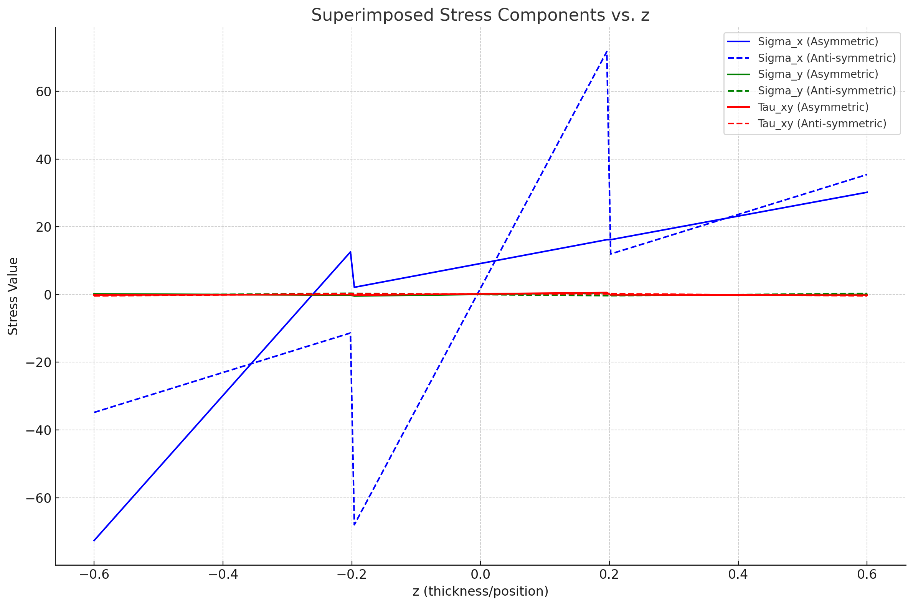
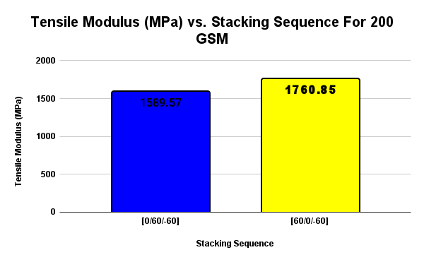
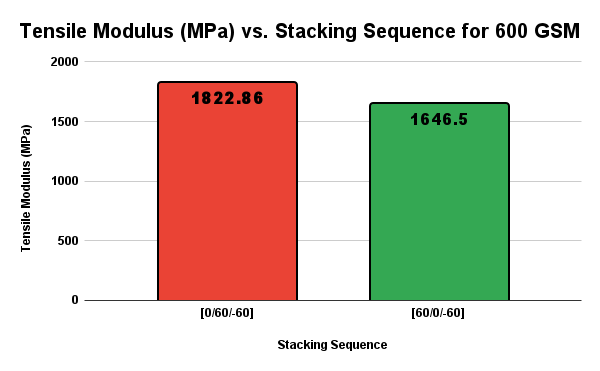
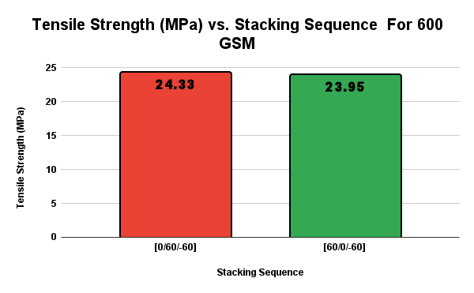
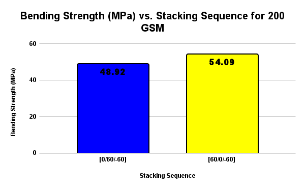
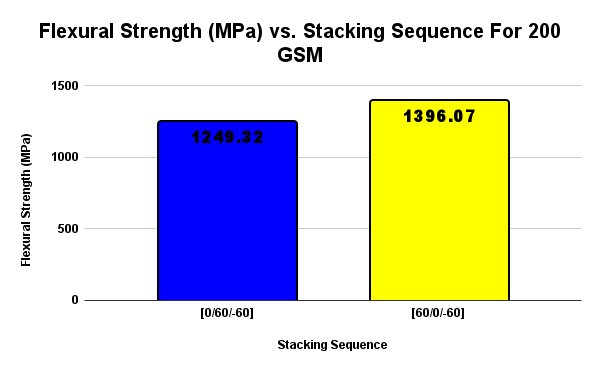
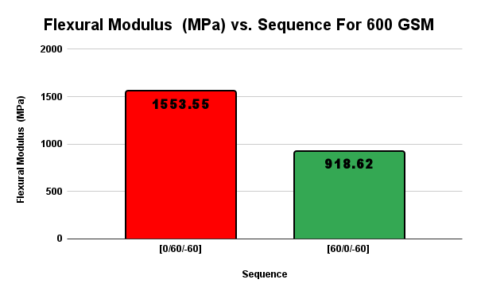

[](./LICENSE)
[](./LICENSE-DOCS-CC-BY-NC-4.0.txt)
# Effects of Lamina Stacking Sequence and Areal Weight (GSM) on the Mechanical Properties of S‑Glass/Polyester Composites

**Authors:** Sajid Sadman · Mahfuz Ahmed · Raiyan Hossain  
**Affiliation:** Department of Mechanical & Production Engineering (MPE), Ahsanullah University of Science & Technology (AUST), Dhaka‑1208, Bangladesh  
**Date:** June 2025

> 📄 **Thesis PDF:** [`report/thesis.pdf`](report/thesis.pdf)  
> 🧪 **MATLAB code:** [`code/matlab/`](code/matlab/) → `clt_abd.m`, `run_laminate_final.m`  
> 📊 **Processed CSVs:** [`data/processed/`](data/processed/)  
> 🖼️ **Figures:** [`figures/`](figures/)

---

## TL;DR
- **Problem:** quantify how **stacking sequence** and **areal weight (GSM)** affect tensile/flexural behavior of S‑glass/polyester laminates.  
- **Approach:** fabricate laminates at **200 GSM** and **600 GSM** with two lay‑ups — **asymmetric** `[0/+60/−60]` and **anti‑symmetric** `[+60/0/−60]`; run ASTM tensile/bending tests and **CLT** (Classical Lamination Theory) in MATLAB.  
- **Result (high level):** 200 GSM tends to excel in **bending**, while 600 GSM shows higher **tensile** capacity; lay‑up choice meaningfully shifts modulus/strength.

---

## Repository structure
```
thesis-sglass-polyester-laminate/
├─ report/
│  └─ thesis.pdf
├─ code/
│  └─ matlab/
│     ├─ clt_abd.m              % computes ABD matrices for a stack
│     └─ run_laminate_final.m   % entry point: reproduces CSVs/figures
├─ data/
│  ├─ processed/
│  │  ├─ stress_0-plus60-minus60_asymmetric.csv
│  │  ├─ stress_plus60-0-minus60_antisymmetric.csv
│  │  ├─ strain_0-plus60-minus60_asymmetric.csv
│  │  └─ strain_plus60-0-minus60_antisymmetric.csv
│  └─ (raw/… optional, keep large files private)
├─ figures/
│  ├─ superimposed-strain-components.png
│  ├─ superimposed-stress-components.png
│  ├─ tensile-modulus-200gsm-by-sequence.png
│  ├─ tensile-modulus-600gsm-by-sequence.png
│  ├─ tensile-strength-200gsm-by-sequence.png
│  ├─ tensile-strength-600gsm-by-sequence.png
│  ├─ bending-strength-200gsm-by-sequence.png
│  ├─ bending-strength-600gsm-by-sequence.png
│  ├─ flexural-strength-200gsm-by-sequence.png
│  └─ flexural-modulus-600gsm-by-sequence.png
└─ README.md
```

---

## Quick start (MATLAB)

Tested on **R2023b**; Signal Processing Toolbox recommended.

```matlab
% In MATLAB, from the repo root:
addpath(genpath('code'));          % or run a startup.m if you add one
run('code/matlab/run_laminate_final.m');
```

The script will:
- call **`clt_abd.m`** to compute **A/B/D** for each stack,
- reconstruct through‑thickness **stress** and **strain**,
- write CSVs into `data/processed/` with the names above,
- and save plots into `figures/`.

If your environment differs, open `code/matlab/run_laminate_final.m` and edit the **material properties**, **stack definitions**, and **file paths** at the top.

---

## Data (processed)
Small, publishable CSVs generated by the MATLAB workflow:

- `data/processed/stress_0-plus60-minus60_asymmetric.csv`  
- `data/processed/stress_plus60-0-minus60_antisymmetric.csv`  
- `data/processed/strain_0-plus60-minus60_asymmetric.csv`  
- `data/processed/strain_plus60-0-minus60_antisymmetric.csv`  

> Large or confidential raw spreadsheets should remain private; this repo includes only the small **processed** artifacts needed to reproduce the figures.

---

## Figure gallery (key results)

<p align="center">
  
  
</p>

<p align="center">
  
  
</p>

<p align="center">
  
  
</p>

<p align="center">
  
  
</p>

<p align="center">
  
  
</p>

---

## License
- **Docs (thesis & figures):** CC BY 4.0 (or CC BY‑NC 4.0 if you prefer non‑commercial use only).  
- **Code:** MIT.

Add your chosen licenses as files at the repo root: `LICENSE` and/or `LICENSE-DATA`.

---

## Citation
If you reference this work, please cite:

```bibtex
@thesis{sadman_ahmed_hossain_2025,
  title  = {Effects of Lamina Stacking Sequence and Areal Weight (GSM) on the Mechanical Properties of S‑Glass/Polyester Composites},
  author = {Sajid Sadman and Mahfuz Ahmed and Raiyan Hossain},
  school = {Department of Mechanical and Production Engineering (MPE), Ahsanullah University of Science and Technology (AUST)},
  year   = {2025},
  address= {Dhaka‑1208, Bangladesh}
}
```

(Optionally add a `CITATION.cff` file at the repo root so GitHub shows a **“Cite this repository”** box.)

---

## Contact
Sajid Sadman · Mahfuz Ahmed · Raiyan Hossain  
Department of Mechanical & Production Engineering (MPE), AUST
